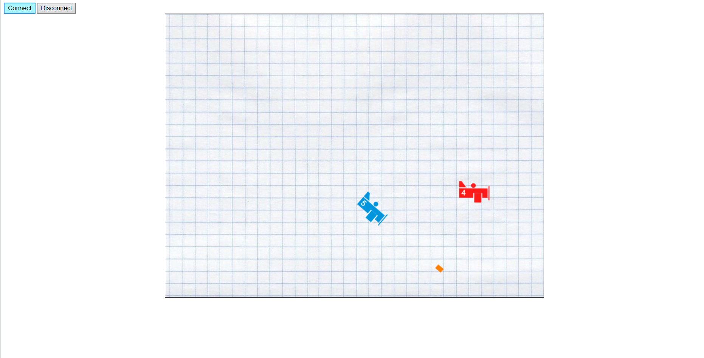

# planes-game
Mini game with planes which based on websockets.

The client developed on javascript and server on php.

To launch the game the port 8889 should be opened on your server, 
then you need to start server first, from your browser by adding the following to URL "/server.php" (without quotes), 
or by executing from consol panel. 
And then click "Connect" button on index page.

### Controls:  
- Tangage - "arrow up", "arrow down"  
- Fire    - F 

